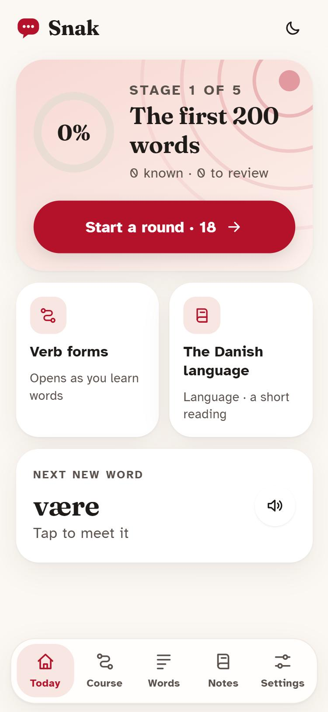
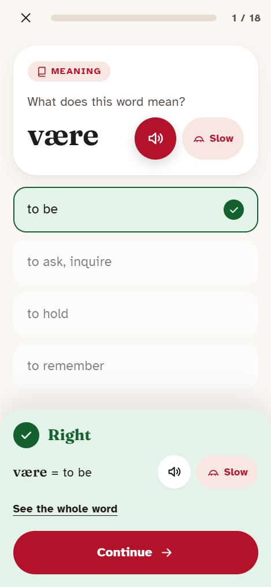
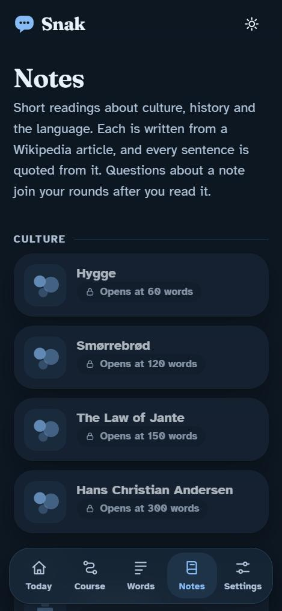

# Snak — learn Danish

A phone-first app for learning Danish (dansk): short rounds of spaced questions, real voices where they exist, a clear
computer voice for everything else, and short notes on culture, history and the language. It works offline once opened and
installs to the home screen. Free, open source, and made for a beginner.

**Try it:** https://robertwalterj.github.io/snak/

  

## What it does

- **Short rounds.** Eighteen questions at a time (12, 18, 25 or 40). Words come back just before you would forget them,
  scheduled by FSRS. A round is never cut short, and there is always an "Another round" button.
- **A new-word card** before each new word: meaning, sound (with a Slow button), the pronunciation, forms, and example sentences.
- **Question kinds:** meaning, recall, listening, fill the gap, gender, and a ladder for the hard part of Danish (verb forms: present, past and past participle).
- **Sound, best source first:** a recording by a real person (credited by name), then a computer voice made for the app
  (Piper), then your phone's own voice. Every speaker has a **Slow** button; Settings has Normal, Slow and Very slow, and can
  keep every clip on the device for offline use.
- **Notes:** 14 readings on culture, history and the language. Every sentence is quoted from a named, dated Wikipedia
  revision, and the build fails if a quotation is not in its article.
- **Made to be easy to read:** left-aligned text, open spacing, a typeface designed for legibility, no timers anywhere, three
  palettes in light and dark, a large-text option, and an icon and a word (never colour alone) for right and wrong.

## How it is built

The words come from subtitle frequency, the meanings and forms from Wiktionary, and the sentences from Tatoeba. Nothing is
invented: `build/verify.mjs` re-derives every answer in the **shipped** deck from those sources and fails the build if one
differs, and `build/test-verify.mjs` plants 15 deliberate faults to prove that it does. `build/test-sched.mjs` simulates
learners over 60 days against the real scheduler (a round is never short; a casual learner still meets new words).
`build/audit-colour.mjs` checks the contrast of every palette. The engine is shared with its sibling app
[Saga](https://github.com/RobertWalterJ/saga); only `content/lang.mjs` and the data differ.

```
node build/fetch-sources.mjs   # download the open data into sources/
npm run corpus                 # words, glosses, sentences (corpus/)
npm run notes                  # save the Wikipedia articles the notes quote
npm run audio                  # find and download the real-person recordings
npm run deck                   # build app/data/deck.json
npm run check                  # verify everything
npm run dev                    # serve app/ on localhost
npm run credits && npm run deploy   # CREDITS.md and the Pages site in docs/
```

The computer-voice clips are made by `tools/gen_audio.py` with [Piper](https://github.com/OHF-Voice/piper1-gpl):

```
python -m venv tools/venv && tools/venv/Scripts/pip install -r tools/requirements.txt     # (bin/ on Mac or Linux)
# download the voice (.onnx and .onnx.json) into tools/models/ from
#   https://huggingface.co/rhasspy/piper-voices/resolve/main/da_DK/talesyntese/medium/da_DK-talesyntese-medium.onnx
tools/venv/Scripts/python tools/gen_audio.py .
```

Without clips the app still works and uses the phone's voice.

`docs/` is generated and is what GitHub Pages serves. Do not edit it by hand.

## Licences and credits

- **Code:** MIT (see LICENSE).
- **Word list, questions and notes:** made from English Wiktionary, Tatoeba and Wikipedia, so they are shared under
  **CC BY-SA 4.0** with the credits in [CREDITS.md](CREDITS.md).
- **Recordings:** each by its own speaker and licence, listed in CREDITS.md. Some Tatoeba recordings are CC BY-NC-ND, so they
  are shared unmodified, credited, and for non-commercial use only.
- **Computer voice:** Piper, with a voice trained on open data (see CREDITS.md).

## Danish notes

- Danish verbs do not change with the person, so the ladder is by time only. It covers the 160 commonest verbs whose Wiktionary entry gives present, past and participle (480 questions). Incomplete entries are skipped, not guessed.
- Spelling hides many sounds (and the stød). The new-word card shows the pronunciation from Wiktionary; the stød has a note of its own.

## Honest limits

- Real recordings are few. Most clips are a computer voice, which is flat and speaks single words without context. Please tell
  me which pronunciations sound wrong.
- Gap questions can have more than one grammatical answer; the English translation is shown to settle it.
- No level check (there is a "skip the first stages" choice), no conversations, no speaking practice.
- Tested in a browser at phone width; not yet on many real devices.
